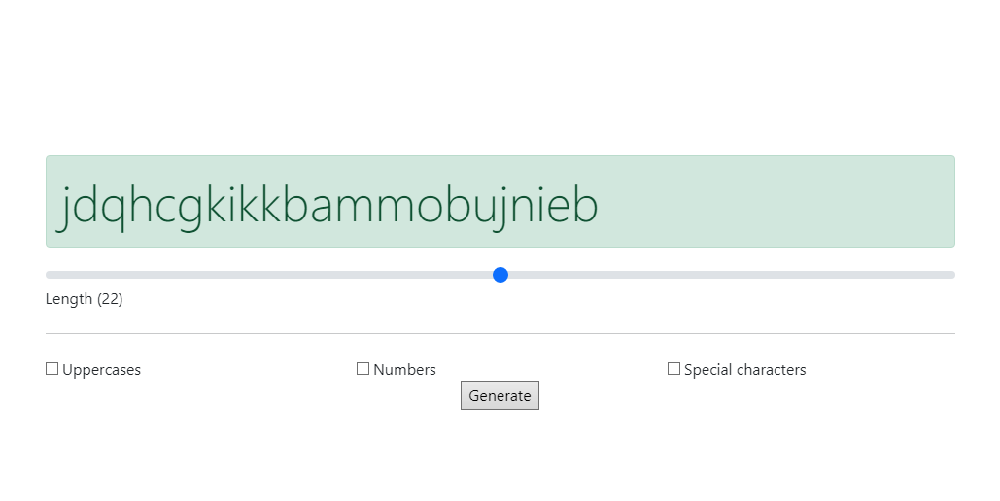

# Password Generator

Tool that generate randomly strong passwords.

## Start

Go to the [website](https://lucasvbr.github.io/PasswordGenerator/) then :
- move the cursor to the length you want
- check characters you want

## Made with

- HTML5, CSS3, JS
- Bootstrap5
- Visual Studio Code, GitHub Desktop

## Author
Listez le(s) auteur(s) du projet ici !
* [**@LucasVbr**](https://github.com/lucasvbr)

All the [contributors](https://github.com/lucasvbr/PasswordGenerator/contributors) of the project are here !
